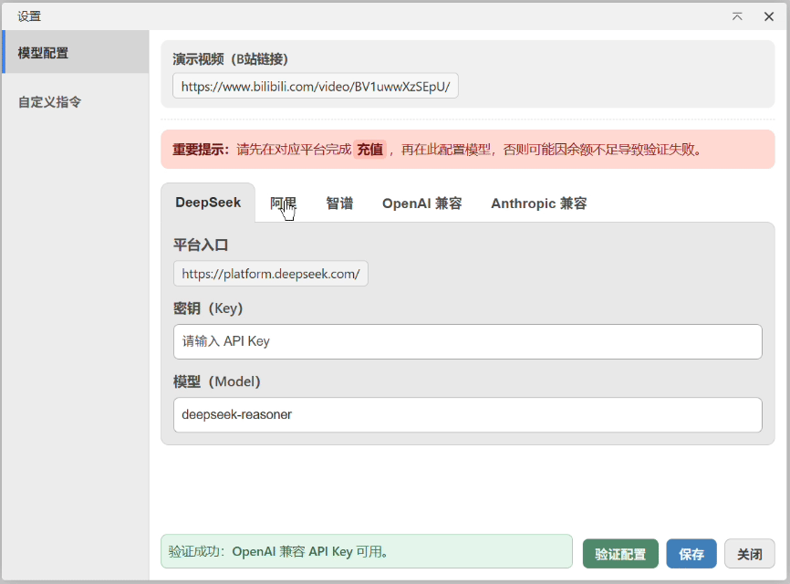

# AI 设计助手

B站教程视频：https://

你可以在 EDA 里直接和 AI 对话，描述需求、分析电路，或让 AI 帮你完成在 EDA 上的操作。

项目地址：https://github.com/sengbin/JLCEDA-Design-Copilot

## 安装

打开嘉立创 EDA，进入扩展管理器，搜索"AI 设计助手"并安装。

## 能做什么

- 聊天式交互，支持连续追问，不用每次重新描述背景。
- 可以在对话里调用 EDA API，减少重复手工操作。
- 工具调用结果包含文件时，AI 会在回复中附上可点击的下载链接。
- 支持多会话：新建、切换、删除。
- 支持图片上传与粘贴，图片可悬停预览。
- 支持会话保存，重新打开页面后可以继续。

## 支持的模型平台

目前内置支持：

- DeepSeek
- 智谱（GLM）
- 阿里（通义）
- 百度（文心）
- 自定义（填写任意兼容 OpenAI 接口的 Endpoint）

## 开始使用

1. 在嘉立创 EDA 安装并启用插件。
2. 打开顶部菜单 `AI 设计助手`，选择 `AI 设置`。
3. 选择平台，填写 `API Key` 和 `Model`。
4. 点击 `验证配置`，通过后点击 `保存`。
5. 打开 `AI 设计助手` 菜单，进入 `开始聊天`，开始使用。

## DeepSeek 配置示例

### 第 1 步：获取 API Key

1. 打开 [DeepSeek 开放平台](https://platform.deepseek.com/)，注册并登录。
2. 进入 `API Keys`，创建新密钥并保存。

### 第 2 步：在插件中填写配置

在 `AI 设置` 页面选择 DeepSeek，填写：

- `API Key`：平台生成的密钥。
- `Model`：默认 `deepseek-reasoner`，可换成账号可用的其他模型。

### 第 3 步：验证并保存

点击 `验证配置`，成功后点击 `保存`，返回聊天页开始使用。

## 注意事项

- 建议先充值再验证，余额不足会导致调用失败。
- 必须验证通过后配置才算可用。
- 单次最多添加 5 张图片。
- DeepSeek 当前不支持图片上传。
- 图片去重规则：本地上传按文件名去重；截图按内容去重，同一截图不会重复添加。
- 剪贴板截图自动命名为 `屏幕截图 1`、`屏幕截图 2`（不带扩展名）。
- AI 结果建议人工复核，特别是关键参数和执行结果。

## 常见问题

### 发送后没有结果

- 检查是否已验证配置并点击了保存。
- 检查当前平台的 API Key 是否可用。
- 检查网络是否可以访问对应的模型平台。

### 上传不了图片

- DeepSeek 平台不支持图片上传，这是正常行为。
- 其他平台需要模型本身支持图片输入。

### 历史会话会不会丢

不会。会话保存在本地，可在顶部会话栏切换和删除。

## 许可证

本扩展采用 [Apache License 2.0](LICENSE) 许可证。
