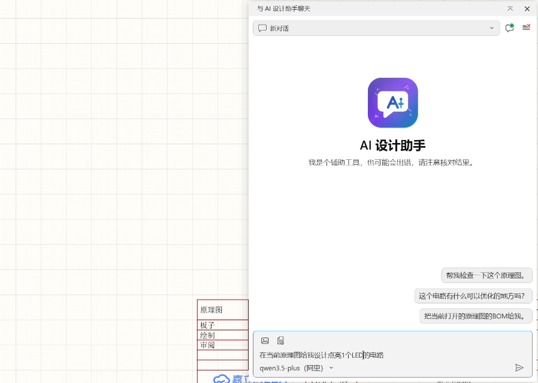
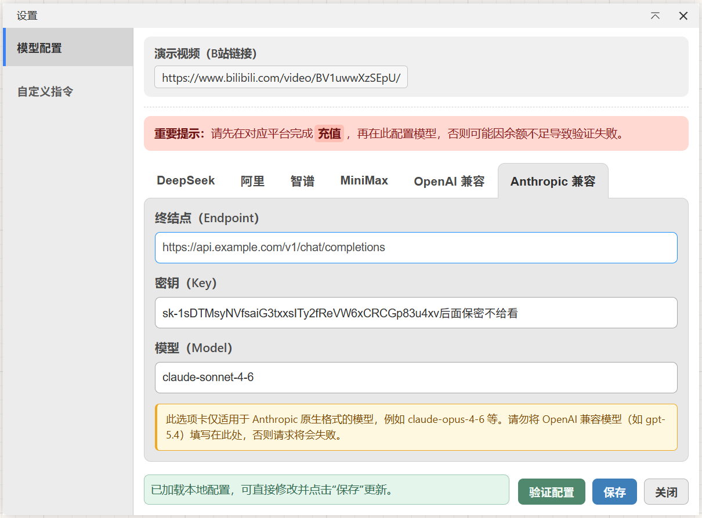

# AI 设计助手

语义级原理图解析，AI 能真正读懂电路结构（识别器件、理解引脚网络连接关系），在此基础上完成电路审查、器件选型与自动放置，从分析到执行，一次对话全程搞定。

B站演示视频：https://www.bilibili.com/video/BV1uwwXzSEpU/

讨论QQ群：9041389，欢迎你反馈更多的问题和建议。

项目地址：https://github.com/sengbin/JLCEDA-Design-Copilot

## 安装

打开嘉立创 EDA，进入扩展管理器，搜索"AI 设计助手"并安装。

## 能做什么

### 原理图操作

- **原理图语义读取（`schematic_read`）**：读取当前激活页面的完整电路语义快照，返回器件列表、引脚→网络名映射与网络连接关系，AI 可直接理解电路结构与功能，并输出包括电路功能概述、器件选型合理性、电源方案、信号连线、保护可靠性、整体可用性评估的结构化分析报告。
- **全工程原理图审查（`schematic_review`）**：读取全工程所有原理图页面的网表文件，覆盖多页电路的器件与网络连接关系，适合全局电路审查、完整 BOM 核查、跨页信号追踪。
- **器件选型与放置**：描述需要放置的器件后，AI 搜索系统库中的候选器件，以列表展示供你确认，确认后引导你在图纸上逐个点击确认放置位置。
- **任务进度面板**：多步任务执行时，AI 实时更新任务面板中的结构化待办列表，显示每一步的进度与当前执行状态。

### 交互与会话

- 聊天式交互，支持连续追问，不用每次重新描述背景。
- 支持图片上传与粘贴，可截图描述问题，图片可悬停预览。
- 支持文档上传（.txt、.md、.csv 等纯文本格式），AI 可直接读取文档内容。
- 多步任务执行时，任务面板实时显示每一步的进度和当前步骤名称。
- AI 思考和执行过程自动折叠收起，不占用主界面空间，需要查看时点击展开。
- 采用虚拟列表技术，长对话下界面滚动依然流畅，不会因消息条数增多而卡顿。
- 支持多会话：新建、切换、删除。
- 会话本地保存，重新打开页面后可以继续上次的对话。

## 支持的模型平台

目前内置支持：

- DeepSeek
- 智谱（GLM）
- 阿里（通义）
- MiniMax
- OpenAI 兼容（自定义兼容 OpenAI 接口的模型，如 GPT 模型）
- Anthropic 兼容（自定义兼容 Anthropic 接口的模型，如 Claude 模型）

## 开始使用

1. 在嘉立创 EDA 安装并启用插件。
2. 打开顶部菜单 `AI 设计助手`，选择 `AI 设置`。
3. 选择平台，填写 `API Key` 和 `Model`。
4. 点击 `验证配置`，通过后点击 `保存`。
5. 打开 `AI 设计助手` 菜单，进入 `开始聊天`，开始使用。

## DeepSeek 配置示例

### 第 1 步：获取 API Key

1. 打开 [DeepSeek 开放平台](https://platform.deepseek.com/)，注册并登录。
2. 进入 `API Keys`，创建新密钥并保存。

### 第 2 步：在插件中填写配置

在 `AI 设置` 页面选择 DeepSeek，填写：

- `API Key`：平台生成的密钥。
- `Model`：默认 `deepseek-reasoner`，可换成账号可用的其他模型。

### 第 3 步：验证并保存

点击 `验证配置`，成功后点击 `保存`，返回聊天页开始使用。

## 注意事项

- 建议先充值再验证，余额不足会导致调用失败。
- 必须验证通过后配置才算可用。
- 单次最多添加 5 张图片。
- 自定义平台默认按 `image_url` 方式发送图片，请确保所填模型支持图像输入。
- 图片去重规则：本地上传按文件名去重；截图按内容去重，同一截图不会重复添加。
- 剪贴板截图自动命名为 `屏幕截图 1`、`屏幕截图 2`（不带扩展名）。
- AI 结果建议人工复核，特别是关键参数和执行结果。

## 常见问题

### 发送后没有结果

- 检查是否已验证配置并点击了保存。
- 检查当前平台的 API Key 是否可用。
- 检查网络是否可以访问对应的模型平台。

### 上传不了图片

- DeepSeek 平台不支持图片上传，这是正常行为。
- 自定义平台请确认模型支持图像输入，不支持图像的文本模型会在调用时报错。
- 其他平台需要模型本身支持图片输入。

### 历史会话会不会丢

不会。会话保存在本地，可在顶部会话栏切换和删除。

## 许可证

本扩展采用 [Apache License 2.0](LICENSE) 许可证。
