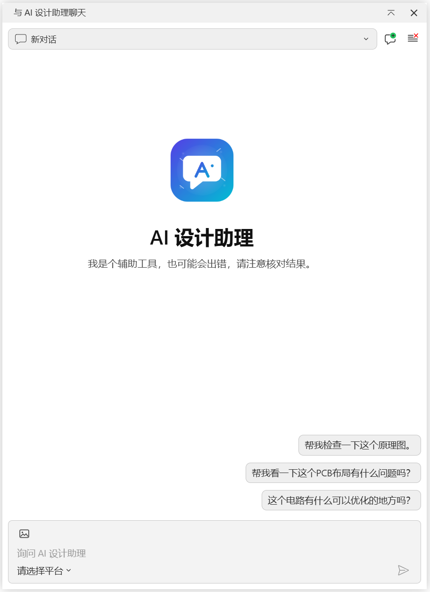
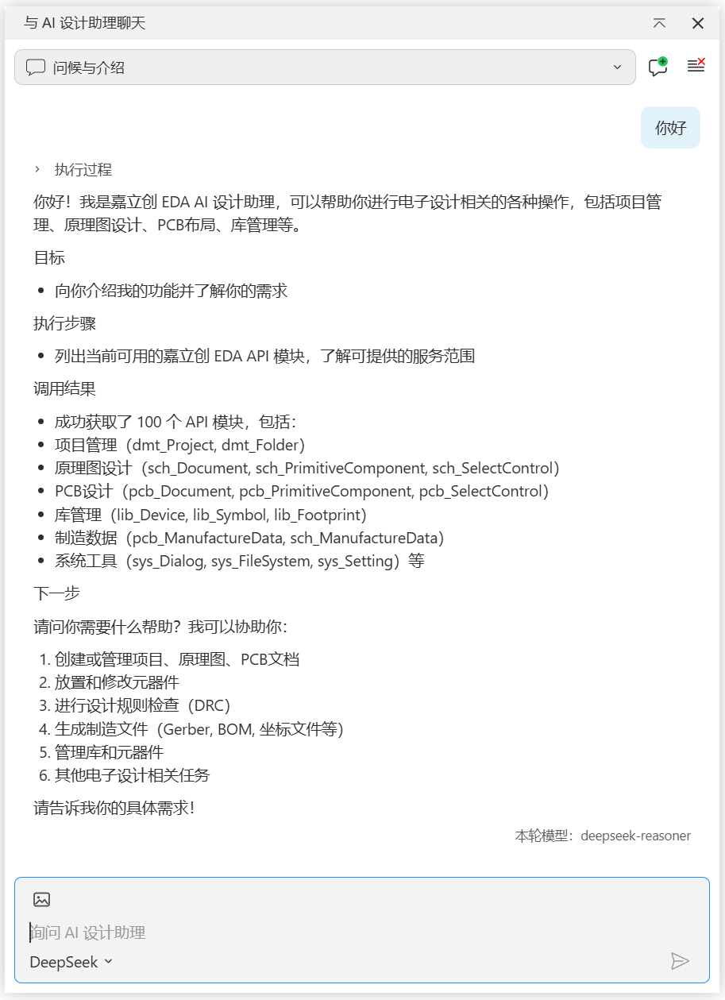
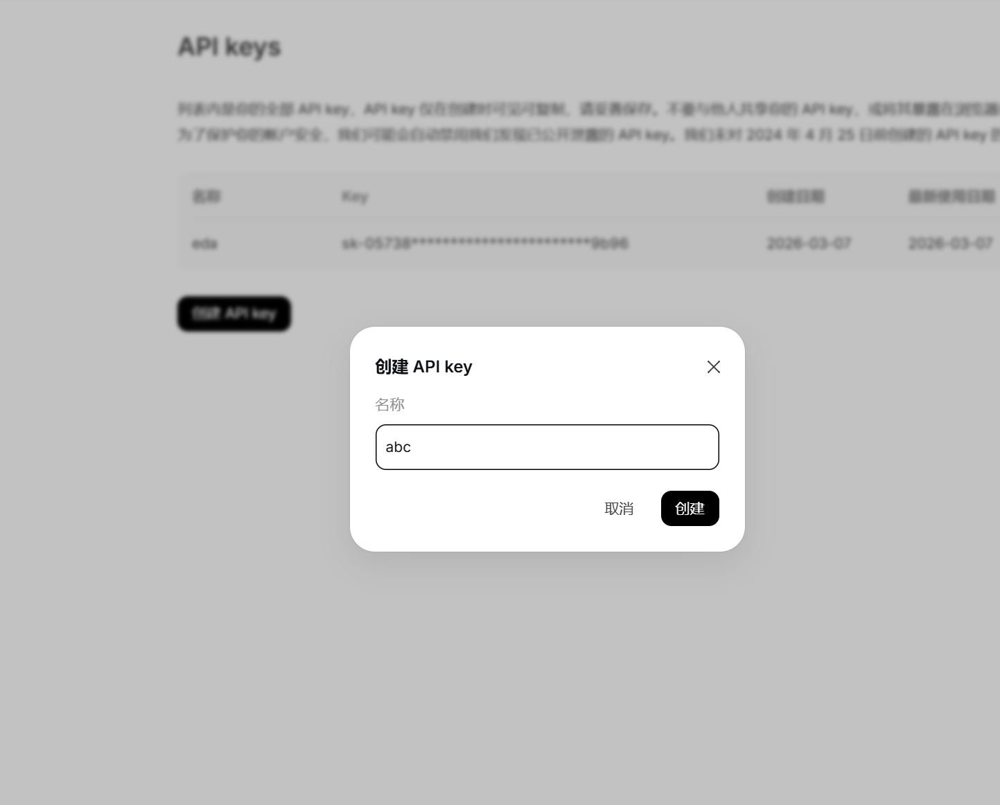
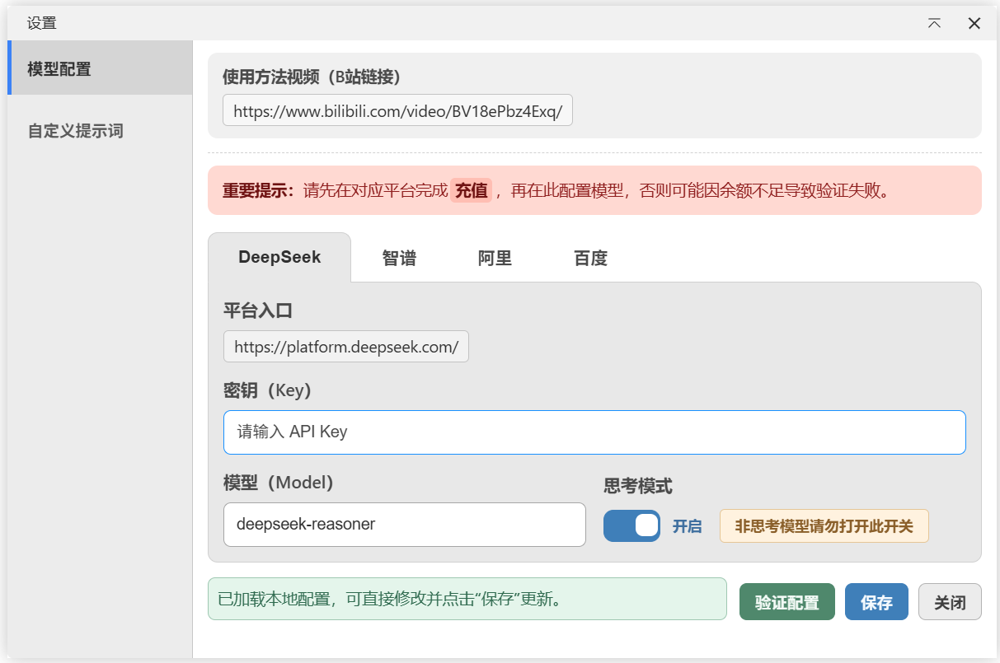
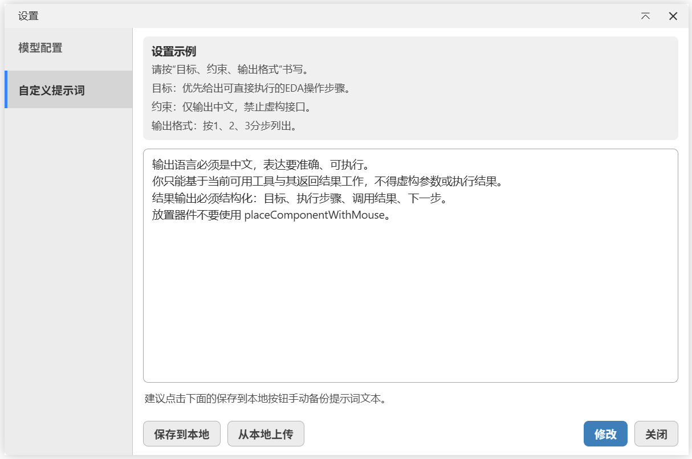

# AI 设计助手

`AI 设计助手` 是嘉立创 EDA 专业版里的一个对话插件。
你可以直接说需求，它会帮你梳理思路、分析问题，并在需要时调用 EDA API 做操作。

---

## 能做什么

- 你提需求，它给原理图设计思路和执行步骤。
- 支持连续追问，不用每次从头描述。
- 可以在对话里调用 EDA API，减少重复手工操作。
- 支持会话保存，方便回看之前的讨论过程。

---

## 主要功能

- 支持多个模型平台：DeepSeek、智谱、阿里、百度。
- 设置页可验证 `API Key`，避免配置后才发现不能用。
- 思考模式可开关，并且按平台单独记忆。
- 支持多会话：新建、切换、删除。
- 支持图片上传与粘贴，图片可悬停预览。

---

## 开始聊天

1. 在嘉立创 EDA 专业版安装并启用插件。
2. 打开顶部菜单 `AI 设计助手`，进入 `设置`。
3. 选择平台，填写 `API Key` 和 `Model`。
4. 点击 `验证配置`，通过后点击 `保存`。
5. 回到 `聊天` 页输入需求，开始使用。

---

## DeepSeek 配置示例

### 第 1 步：登录平台

1. 打开 [DeepSeek 开放平台](https://platform.deepseek.com/)。
2. 注册并登录账号。

### 第 2 步：创建 API Key

1. 进入 `API Keys`（或密钥管理）。
2. 创建新密钥并复制保存。

### 第 3 步：在插件里填写配置

在插件 `设置` 页面选择 DeepSeek，填写：

- `API Key`：平台生成的密钥。
- `Model`：默认 `deepseek-reasoner`，也可以换成你账号可用模型。

### 第 4 步：验证并保存

1. 点击 `验证配置`。
2. 验证成功后点击 `保存`。
3. 返回聊天页开始使用。

---

## 使用时要注意

- 建议先充值再验证，余额不足会导致调用失败。
- 必须先验证通过，配置才算可用。
- 单次最多添加 5 张图片。
- DeepSeek 当前不支持图片上传。
- 图片去重规则：
  - 本地上传按文件名去重（同名只保留一张）。
  - 剪贴板截图按内容去重（同一截图不会重复添加）。
- 剪贴板截图会自动命名为 `屏幕截图 1`、`屏幕截图 2`（不带扩展名）。
- AI 结果建议人工复核，特别是关键参数和执行结果。

---

## 常见问题

### 1）发送后没结果怎么办

按顺序检查：

- 是否已经 `验证配置` 并点击 `保存`。
- 当前平台是否填写了可用 `API Key`。
- 当前网络是否能访问对应模型平台。

### 2）为什么上传不了图片

- 如果当前是 DeepSeek，图片上传不可用是正常行为。
- 其他平台需要模型本身支持图片输入。

### 3）历史会话会丢吗

不会。会话保存在本地，可在顶部会话栏里切换和删除。

---

## 许可证

Apache-2.0
